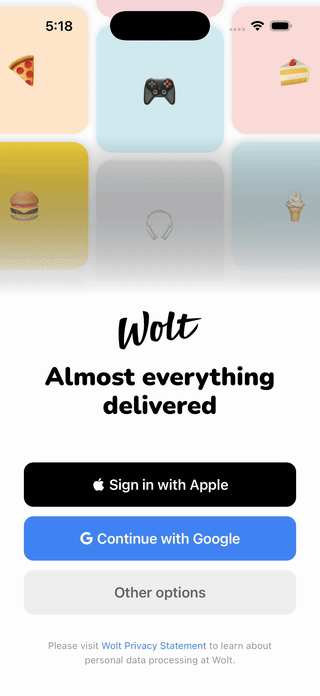
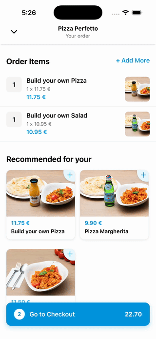
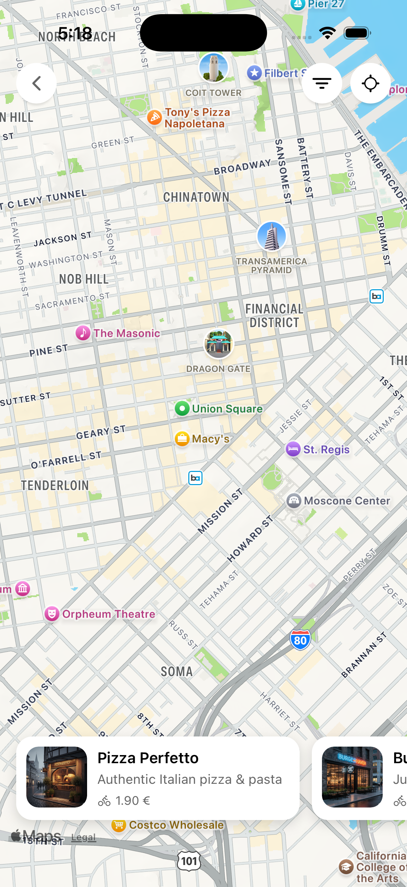
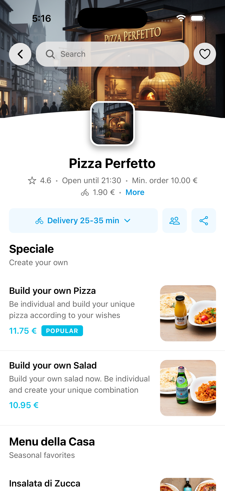
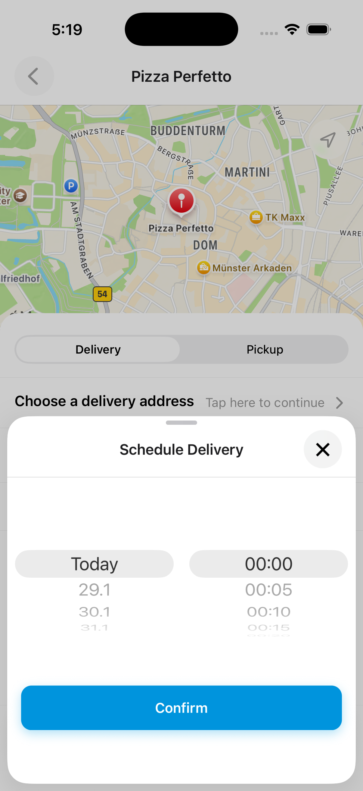

# Wolt Clone - React Native & Expo

A high-fidelity clone of the Wolt delivery application built with React Native and Expo. This project was developed to explore advanced UI patterns, complex animations, and seamless user experiences in mobile applications.

## Showcase

The project replicates the smooth interactions of the original app, utilizing `react-native-reanimated` for native-performance animations.

### Interactions & Animations

| Sticky Header | Login Flow | Cart Gestures |
| :--- | :--- | :--- |
|  |  |  |

### Screen Captures

| Discovery & Map | Restaurant Detail | Schedule & Cart |
| :--- | :--- | :--- |
|  |  |  |

## Technical Features

*   **Animations:** Implementation of complex interpolation, parallax effects, and layout animations using React Native Reanimated.
*   **Navigation:** Robust file-based routing with Expo Router, including nested stacks, tabs, and modal patterns.
*   **State Management:** High-performance state handling with Zustand and ultra-fast persistence via MMKV.
*   **Gestures:** Interactive UI components built with React Native Gesture Handler.
*   **Maps:** Integrated native map views and location services.
*   **Architecture:** Clean and modular structure separating services, hooks (stores), and UI components.

## Tech Stack

*   **Framework:** Expo (SDK 54) / React Native
*   **Routing:** Expo Router
*   **Animation:** React Native Reanimated
*   **State:** Zustand & React Query
*   **Storage:** MMKV
*   **UI:** Expo Blur, Linear Gradient, and SVG support

## Installation

1. Clone the repository:
   ```bash
   git clone https://github.com/barbar0jav1er/wolt-react-native.git
   ```

2. Install dependencies:
   ```bash
   bun install # or npm install
   ```

3. Start the project:
   ```bash
   npx expo start
   ```

## Project Structure

*   `/app`: File-based routing (Expo Router).
*   `/components`: Atomic and screen-level components.
*   `/hooks`: Logic and state management (Zustand stores).
*   `/services`: API and data handling logic.
*   `/docs`: Media assets for documentation.

---

*Disclaimer: This project is for educational and portfolio purposes. All design rights belong to Wolt.*